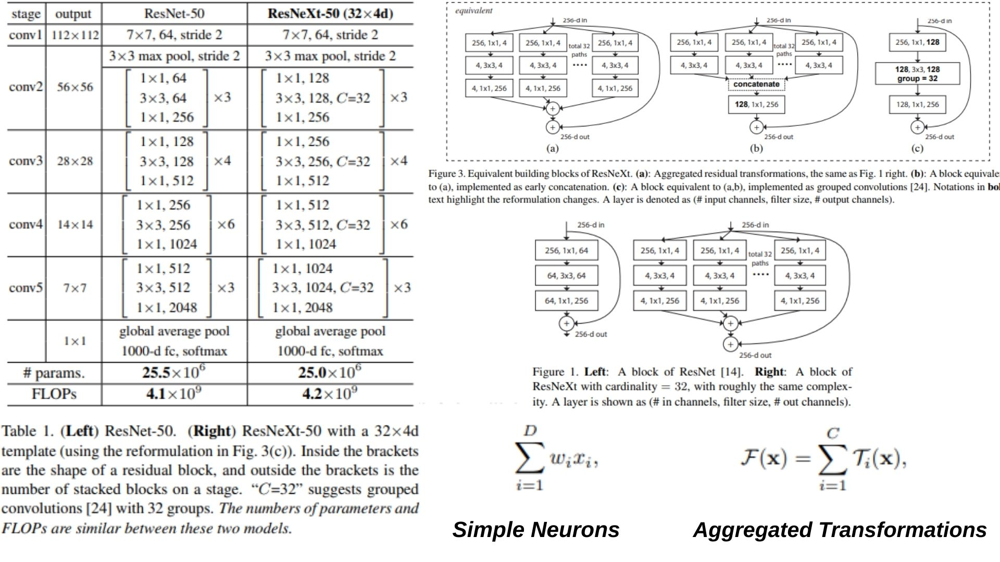

# 🌄 ResNeXt-Replication PyTorch Implementation

This repository contains a replication of **ResNeXt-50 (32×4d)** using PyTorch, following the **aggregated residual transformations** concept. The model is designed for **efficient and high-capacity image classification** by using **grouped convolutions** to expand cardinality while maintaining manageable FLOPs.

- Implemented **ResNeXt-50** with **bottleneck blocks** and **grouped convolutions**.  
- Architecture:  
**Stem → ResNeXt Blocks → GlobalAvgPool → Flatten → FC**

> **Note on ResNeXt:** The model uses **cardinality C** as an additional dimension, aggregating multiple transformations `T_i(x)` in each residual block. Grouped convolutions implement these parallel transformations efficiently.

**Paper reference:** [Aggregated Residual Transformations for Deep Neural Networks (ResNeXt)](https://arxiv.org/abs/1611.05431) ⚡

---

## 🖼 Overview – ResNeXt-50 Architecture

  

- *Figure 1* illustrates the **aggregated residual transformations** in ResNeXt: multiple parallel transformations `T_i(x)` are summed to form the residual function, increasing cardinality and capacity without proportionally increasing FLOPs.  
- *Figure 3* shows the **equivalent reformulations**: (a) original aggregated paths, (b) early concatenation, (c) grouped convolutions — the last is what we implement for efficiency.  
- *Table 1* compares **ResNet-50 vs ResNeXt-50 (32×4d)**: similar number of parameters and FLOPs, but ResNeXt achieves higher accuracy by exploiting cardinality.  

> **Model highlights:**  
> - Bottleneck blocks with **grouped convolutions** increase cardinality while keeping computation efficient.  
> - Identity shortcuts enable gradient flow and stable training.  
> - Global average pooling + flatten ensures consistent input to the final fully connected layer.  
> - Homogeneous transformation topology across paths simplifies implementation and scales efficiently.


---

## 🧮 Mathematical Concepts

### Normal Neuron

$$
y = \sum_{i=1}^{D} w_i x_i
$$

- **x**: input vector of size D  
- **w**: weights of the neuron  
- Represents simple inner-product aggregation.

### Aggregated Transformations (ResNeXt)

$$
F(x) = \sum_{i=1}^{C} T_i(x)
$$

- **x**: input tensor  
- **T_i**: transformation function (bottleneck-shaped)  
- **C**: cardinality, number of parallel paths  
- Expands the idea of a neuron by aggregating multiple transformations instead of a single weighted sum.

> The difference: a normal neuron sums over D dimensions of input, while ResNeXt aggregates C independent transformations (paths) to improve representational power without significantly increasing computational cost.

---

## 🏗️ Model Architecture

```bash
ResNeXt-Replication/
│
├── src/
│   ├── layers/
│   │   ├── conv_layer.py             # Standard conv layer
│   │   ├── flatten_layer.py          # Flatten layer
│   │   ├── fc_layer.py               # Fully connected layer (num_classes)
│   │   ├── pool_layers/
│   │   │   ├── maxpool_layer.py      # MaxPool
│   │   │   └── avgpool_layer.py      # AdaptiveAvgPool
│   │   └── grouped_conv.py           # Grouped convolution wrapper
│   │
│   ├── blocks/
│   │   └── resnext_block.py          # ResNeXt bottleneck block (cardinality, grouped conv)
│   │
│   ├── model/
│   │   └── resnext50.py              # Full model: Stem + ResNeXt blocks + Classifier
│   │
│   │
│   └── config.py                     # Input size, num_classes, cardinality, bottleneck width
│
├── images/
│   └── resnext_figure.jpg     # Figures illustrating ResNeXt
│
├── requirements.txt
└── README.md
```
---

## 🔗 Feedback

For questions or feedback, contact: [barkin.adiguzel@gmail.com](mailto:barkin.adiguzel@gmail.com)
